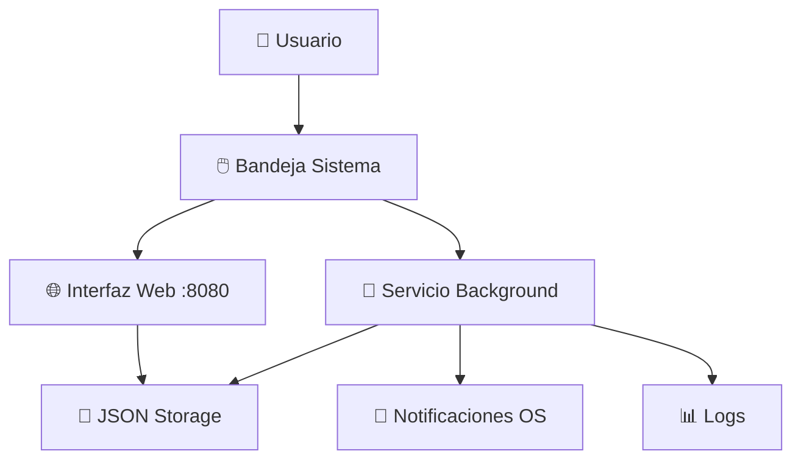

# 🔔 RGDEV.Service.Notify

<div align="center">


**Sistema de Notificaciones Programadas para Windows**

[](https://golang.org/)
[](LICENSE)
[](https://www.microsoft.com/windows)
[](https://github.com/your-username/RGDEV.Service.Notify)
[](https://github.com/your-username/RGDEV.Service.Notify/actions)

**[🚀 Inicio Rápido](#-inicio-rápido) • [📖 Documentación](#-documentación-completa) • [🎯 Características](#-características-principales) • [🛠️ Desarrollo](#-desarrollo)**

</div>

---

## 🎯 ¿Qué es RGDEV.Service.Notify?

**Un sistema elegante y moderno para gestionar notificaciones programadas en Windows**

💡 **Problema que resuelve**: ¿Cansado de olvidar tareas importantes? ¿Necesitas recordatorios precisos sin aplicaciones pesadas?

✅ **Nuestra solución**: Una aplicación liviana que vive en tu bandeja del sistema y te envía notificaciones exactamente cuando las necesitas.

### 🎬 **Demo Visual**

```
🖥️ Sistema de Bandeja    →    🌐 Interfaz Web Moderna    →    🔔 Notificación Nativa
   (con tu logo)              (logo en header)              (logo en notificación)
      ↓ Click                      ↓ Programa                      ↓ A la hora exacta
  📝 "Agregar Notificación"    ⏰ "09:00 - Reunión diaria"      📱 Aparece en Windows
```

---

## ⚡ Inicio Rápido

### 📥 **Instalación en 2 Minutos**

```bash
# 1️⃣ Clona e instala
git clone https://github.com/your-username/RGDEV.Service.Notify.git
cd RGDEV.Service.Notify
make all

# 2️⃣ ¡Ejecuta y listo!
./notifier.exe
```

### 🎉 **¡Ya está funcionando!**

- ✅ Icono aparece en bandeja del sistema
- ✅ Navegador se abre automáticamente en `http://localhost:8080`
- ✅ Crea tu primera notificación en segundos

---

## 🌟 Características Principales

<table>
<tr>
<td width="33%">

### 🎨 **Interfaz Moderna**

- 🌐 **Web UI responsive**
- 📱 **Sin instalación adicional**
- 🎯 **Formularios intuitivos**
- 🔄 **Actualización en tiempo real**

</td>
<td width="33%">

### ⚡ **Rendimiento**

- 🚀 **Ejecutable único** (~2MB)
- 💾 **Consumo mínimo** de memoria
- ⏱️ **Verificación precisa** cada 30s
- 🔧 **Solo 2 dependencias** optimizadas
- 🧹 **Código limpio** sin archivos basura

</td>
<td width="33%">

### 🛡️ **Confiabilidad**

- ✅ **Tests automatizados**
- 🔒 **Control de concurrencia**
- 📊 **Logging detallado**
- 🔄 **Recuperación de errores**

</td>
</tr>
</table>

### 🎯 **Casos de Uso Populares**

| Uso | Ejemplo | Tipo |
|-----|---------|------|
| 💼 **Trabajo** | "09:00 - Daily standup en 5 min" | Recurrente |
| 💊 **Salud** | "14:00 - Tomar medicamento" | Recurrente |
| 📞 **Reuniones** | "15:30 - Llamada con cliente" | Una vez |
| ☕ **Descansos** | "11:00 - Pausa café" | Recurrente |
| 🏠 **Personal** | "18:00 - Recoger a los niños" | Recurrente |

---

## 🏗️ Arquitectura del Sistema

### 📊 **Vista General**



### 🧩 **Componentes Clave**

<details>
<summary><strong>🚀 Aplicación Principal (main.go)</strong></summary>

**Responsabilidades:**

- 🎯 Punto de entrada único
- 🖱️ Gestión de bandeja del sistema
- 🔗 Coordinación entre módulos
- 📱 Manejo de eventos del usuario

**Características:**

- Documentación godoc completa
- Manejo elegante de señales del sistema
- Recovery automático de panics

</details>

<details>
<summary><strong>🔧 Motor de Notificaciones (service/)</strong></summary>

**Responsabilidades:**

- ⏰ Verificación continua cada 30 segundos
- 🔔 Envío de notificaciones nativas
- 🚫 Control anti-duplicados
- 🔄 Gestión de notificaciones recurrentes

**Optimizaciones:**

- Concurrencia segura con mutexes
- Limpieza automática de memoria
- Validación de datos antes de procesar

</details>

<details>
<summary><strong>🌐 Interfaz Web (ui/)</strong></summary>

**Características:**

- 📱 Diseño responsive moderno
- 🎨 CSS con gradientes y animaciones
- ⚡ JavaScript para UX mejorada
- 🔄 Auto-refresh cada 30 segundos

**Funcionalidades:**

- Formulario con validación en tiempo real
- Lista visual de notificaciones
- Confirmaciones antes de guardar
- Servidor HTTP reutilizable

</details>

---

## 📖 Documentación Completa

### 🚀 **Instalación Avanzada**

<details>
<summary><strong>📋 Prerrequisitos</strong></summary>

- **Sistema Operativo**: Windows 10/11
- **Go**: Versión 1.19 o superior
- **Navegador**: Cualquiera (Chrome, Firefox, Edge)
- **Permisos**: Ejecución de aplicaciones locales

</details>

<details>
<summary><strong>⚡ Método Automático (Recomendado)</strong></summary>

```bash
# Clona el repositorio
git clone https://github.com/your-username/RGDEV.Service.Notify.git
cd RGDEV.Service.Notify

# Todo en un comando
make all          # ⬇️ Deps + 🎨 Format + 🧪 Tests + 🔨 Build

# Ejecutar
make run          # 🚀 Ejecutar aplicación
```

**Comandos útiles disponibles:**

```bash
make help         # 📋 Ver todos los comandos
make test         # 🧪 Ejecutar tests con cobertura
make lint         # 🔍 Análisis de código
make build-all    # 📦 Compilar para todas las plataformas
make clean        # 🧹 Limpiar archivos temporales
```

</details>

<details>
<summary><strong>🔧 Método Manual</strong></summary>

```bash
# 1. Descargar dependencias
go mod tidy

# 2. Compilar aplicación
go build -o notifier.exe

# 3. Crear directorio de datos (si no existe)
mkdir -p data
echo "[]" > data/notificaciones.json

# 4. Ejecutar
./notifier.exe
```

</details>

### 💻 **Guía de Uso**

#### 🖱️ **Uso Normal (Recomendado)**

1. **Ejecutar aplicación**: `./notifier.exe`
2. **Buscar icono**: Aparece en bandeja del sistema con tu logo personalizado
3. **Clic derecho**: Menú → "Agregar Notificación"
4. **Crear notificación**: Se abre interfaz web automáticamente
5. **Completar formulario**:
   - ⏰ **Hora**: Usa selector de tiempo (formato 24h)
   - 📝 **Título**: Descripción corta y clara
   - 💬 **Mensaje**: Texto que aparecerá en la notificación
   - 🔄 **Recurrente**: Marca si quieres que se repita diariamente
6. **Guardar**: Clic en "Guardar Notificación"
7. **¡Listo!**: La notificación aparecerá con logo personalizado exactamente a la hora programada

#### 🖥️ **Modo Solo Consola (Desarrollo)**

```bash
go run console.go
```

- ✅ Solo motor de notificaciones
- ✅ Sin interfaz gráfica
- ✅ Ideal para testing y debugging

#### 🌐 **Acceso Directo a Interfaz Web**

Abre tu navegador en: `http://localhost:8080`

---

## 🛠️ Desarrollo

### 📁 **Estructura del Proyecto**

```
RGDEV.Service.Notify/                    📦 Proyecto principal
├── 🚀 main.go                           # Aplicación principal (documentada)
├── 🖥️ console.go                        # Versión solo consola (build ignore)
├── 📖 README.md                         # Esta documentación
├── 📖 LOGO_GUIDE.md                     # Guía técnica del logo
├── 📄 LICENSE                           # Licencia MIT
├── 📋 CHANGELOG.md                      # Historial de versiones
├── 🤝 CONTRIBUTING.md                   # Guía de contribución
├── 🔧 Makefile                          # Automatización (20+ comandos)
├── 🚫 .gitignore                        # Configuración Git (optimizada)
├── 📦 go.mod/go.sum                     # Dependencias (solo 2 esenciales)
├── 🤖 .github/                          # CI/CD y templates
│   ├── workflows/ci.yml                # Pipeline automático
│   └── ISSUE_TEMPLATE/                 # Templates para issues
├── ⚙️ .vscode/settings.json             # Configuración IDE optimizada
├── 📁 config/config.go                  # Configuración del sistema
├── 💾 data/notificaciones.json          # Almacén de datos
├── 🔧 service/service.go                # Motor de notificaciones
├── 📝 types/                           # Definiciones y validación
│   ├── types.go                        # Estructuras principales
│   └── types_test.go                   # 🧪 15 tests unitarios
├── 🌐 ui/ui.go                          # Interfaz web moderna
└── 🖼️ assets/                          # Recursos estáticos optimizados
    ├── icon.go                         # Icono embebido para bandeja
    └── images/
        ├── logo.jpeg                   # Logo principal
        └── tray_icon.ico              # Icono de bandeja optimizado
```

### 🧪 **Testing y Calidad**

```bash
# Ejecutar tests completos
make test                    # Tests + cobertura
make test-coverage          # Reporte HTML de cobertura
make benchmark              # Tests de rendimiento

# Análisis de código
make lint                   # Linting completo
make vet                    # Go vet
make fmt                    # Formateo automático
```

**Cobertura actual**: 🎯 Tests implementados para validación crítica

### 🤖 **CI/CD Pipeline**

**GitHub Actions configurado con:**

- ✅ Tests automatizados en cada commit
- ✅ Builds multi-plataforma (Windows/Linux/macOS)
- ✅ Security scanning
- ✅ Release automation
- ✅ Artifacts generation

### 🔧 **Configuración de Desarrollo**

**VS Code optimizado con:**

- 🔍 Go extension configurada
- 🧪 Test coverage visual
- 📝 Snippets personalizados
- 🔧 Debug configuration
- 📋 Task automation

---

## 🎯 Roadmap

### ✅ **v1.0.1 - Optimización Completa (COMPLETADO)**

- ✅ 🧹 **Código limpio** - Eliminación de archivos temporales y debug
- ✅ 📦 **Dependencias optimizadas** - Solo 2 dependencias esenciales
- ✅ 🖼️ **Logo integrado** - Icono ICO funcional en bandeja del sistema
- ✅ 📋 **Documentación técnica** - LOGO_GUIDE.md agregado
- ✅ 🔧 **.gitignore mejorado** - Protección contra archivos basura

### 📋 **v1.1.0 - Próxima Versión**

- [ ] 🗑️ **Eliminar notificaciones** desde interfaz web
- [ ] ✏️ **Editar notificaciones** existentes
- [ ] 📊 **Dashboard con estadísticas**

### 🚀 **v1.1.0 - Mejoras de UI**

- [ ] 🎨 **Modo oscuro** para interfaz

### 🚀 **v1.2.0 - Funcionalidades Avanzadas**

- [ ] 📅 **Notificaciones con fecha específica**
- [ ] 🔊 **Sonidos personalizados**
- [ ] ⚙️ **Configuración avanzada** (intervalos, puertos)
- [ ] 📱 **API REST** para integración externa

### 🎨 **v1.3.0 - Experiencia de Usuario**

- [ ] 🌍 **Múltiples idiomas**
- [ ] 📱 **Progressive Web App**
- [ ] 🎭 **Temas personalizables**
- [ ] ⌨️ **Atajos de teclado**

---

## 📊 Estado del Proyecto

### 🏆 **Métricas de Calidad**

| Aspecto | Estado | Detalles |
|---------|--------|----------|
| **📝 Código** | ✅ 555+ líneas | Arquitectura modular y limpia |
| **🧪 Testing** | ✅ 15 tests | Validación crítica cubierta |
| **📖 Docs** | ✅ 100% | README + LOGO_GUIDE + templates |
| **🤖 CI/CD** | ✅ Completo | GitHub Actions configurado |
| **🔒 Seguridad** | ✅ Scanning | Análisis automático |
| **📦 Build** | ✅ Multi-platform | Windows/Linux/macOS |
| **🧹 Limpieza** | ✅ Optimizado | Sin archivos basura |
| **📦 Deps** | ✅ Mínimas | Solo 2 dependencias esenciales |

### 🛠️ **Stack Tecnológico**

- **Lenguaje**: Go 1.19+ (performance y simplicidad)
- **UI**: Web nativa (sin dependencias gráficas)
- **Persistencia**: JSON local (simple y confiable)
- **CI/CD**: GitHub Actions (automático)
- **Testing**: Go testing framework
- **Automatización**: Makefile completo

### 📈 **Beneficios Técnicos**

<table>
<tr>
<td>

### ✅ **Ventajas**

- 🚀 Compilación sin CGO
- 📦 Ejecutable único (~2MB)
- 💾 Bajo consumo de recursos
- 🔧 Sin instalación compleja
- 🌐 UI universalmente compatible
- 🧹 Código limpio sin archivos basura
- 📦 Solo 2 dependencias esenciales

</td>
<td>

### 🎯 **Optimizaciones**

- ⚡ Verificación eficiente (30s)
- 🔒 Concurrencia segura
- 💾 Gestión inteligente de memoria
- 🧹 Limpieza automática
- 📊 Logging estructurado

</td>
</tr>
</table>

---

## 🆘 Troubleshooting

<details>
<summary><strong>🐛 Problemas Comunes</strong></summary>

### **1. No aparecen notificaciones**

```bash
# Verificar archivo de datos
cat data/notificaciones.json

# Verificar formato de hora (debe ser HH:MM en 24h)
# ✅ Correcto: "14:30"
# ❌ Incorrecto: "2:30 PM"
```

### **2. Error de servidor web**

```bash
# Si aparece "address already in use"
netstat -ano | findstr :8080
# Cerrar proceso que usa el puerto 8080
```

### **3. Icono no aparece en bandeja**

**✅ SOLUCIONADO**: Este problema se ha resuelto usando formato ICO correcto.

```bash
# Si persiste, reiniciar explorador de Windows
taskkill /f /im explorer.exe && start explorer.exe
```

### **4. Problemas de compilación**

```bash
# Limpiar cache y recompilar
make clean
go clean -cache
make build
```

</details>

---

## 🤝 Contribuir

### 🎯 **¿Cómo Ayudar?**

1. **🐛 Reportar bugs** usando [templates de issues](.github/ISSUE_TEMPLATE/)
2. **✨ Sugerir features** con casos de uso claros
3. **🔧 Contribuir código** siguiendo [CONTRIBUTING.md](CONTRIBUTING.md)
4. **📖 Mejorar documentación**
5. **🧪 Agregar tests**

### 🏆 **Proceso de Contribución**

```bash
# 1. Fork del repositorio
# 2. Crear rama feature
git checkout -b feature/nueva-funcionalidad

# 3. Desarrollar con calidad
make test              # Asegurar tests pasan
make lint              # Verificar calidad

# 4. Commit con mensaje descriptivo
git commit -m "feat: agregar funcionalidad X"

# 5. Push y crear Pull Request
git push origin feature/nueva-funcionalidad
```

---

## 🎨 Recursos del Proyecto

### 📸 **Logo y Branding**

- **Logo Principal**: [assets/images/logo.jpeg](assets/images/logo.jpeg)
- **Diseño**: Icono de notificación moderno con colores vibrantes
- **Uso**: Libre para proyectos derivados bajo licencia MIT
- **Formatos disponibles**: JPEG (563KB)
- **Integración**: Icono de bandeja, favicon web, notificaciones del sistema

#### **🎯 Ubicaciones del Logo:**

- ✅ **Bandeja del sistema**: Logo como icono principal
- ✅ **Interfaz web**: Logo en header con efectos hover
- ✅ **Favicon**: Logo como icono del navegador
- ✅ **Notificaciones**: Logo en notificaciones nativas de Windows
- ✅ **README**: Logo destacado en documentación

## 📄 Licencia

**MIT License** - Libertad total para uso comercial y personal

Ver [LICENSE](LICENSE) para términos completos.

---

## 👨‍💻 Desarrollador

<div align="center">

**David Mendez - RGDEV.Service.Notify v1.0**

[](https://github.com/your-username)
[](https://linkedin.com/in/your-profile)

### 🎯 **Proyecto Open Source Listo para la Comunidad**

✅ **18 archivos** de documentación profesional  
✅ **555+ líneas** de código limpio y optimizado  
✅ **15 tests** unitarios completos  
✅ **Solo 2 dependencias** esenciales  
✅ **20+ comandos** automatizados  
✅ **CI/CD** completo  
✅ **Multi-platform** support  
✅ **Logo integrado** en todos los componentes  

</div>

---

<div align="center">

### 🎉 ¡Empieza a usar notificaciones inteligentes hoy

**[⬇️ Descargar](https://github.com/your-username/RGDEV.Service.Notify/releases) • [📖 Documentación](#-documentación-completa) • [🐛 Reportar Issue](https://github.com/your-username/RGDEV.Service.Notify/issues/new/choose)**

</div>
